<picture>
  <source media="(prefers-reduced-motion: reduce) and (prefers-color-scheme: dark)" srcset="assets/banner.png">
  <source media="(prefers-color-scheme: dark)" srcset="assets/banner-animated.svg">
  <source media="(prefers-reduced-motion: reduce) and (prefers-color-scheme: light)" srcset="assets/banner-light.png">
  <source media="(prefers-color-scheme: light)" srcset="assets/banner-light-animated.svg">
  
</picture>

**I build practical tools across AI, data, and the web.**  
Jeddah, Saudi Arabia · From a useful idea to working software.

[Explore projects](#selected-work) · [Project demos](#project-demos) · [Portfolio ↗](https://alahmadi.me/)

## Selected work

| Project | At a glance |
| :--- | :--- |
| <a href="https://github.com/abdulrhmanG-alahmadi/triagekit-oss"><picture><source media="(prefers-color-scheme: dark)" srcset="assets/triagekit-cover.svg"><source media="(prefers-color-scheme: light)" srcset="assets/triagekit-cover-light.svg"></picture></a> | **[TriageKit](https://github.com/abdulrhmanG-alahmadi/triagekit-oss)** Reliable support-ticket classification with retries and recovery. [Source ↗](https://github.com/abdulrhmanG-alahmadi/triagekit-oss) · [Offline demo](https://github.com/abdulrhmanG-alahmadi/triagekit-oss#start-offline) |
| <a href="https://github.com/abdulrhmanG-alahmadi/leadline"><picture><source media="(prefers-color-scheme: dark)" srcset="assets/leadline-cover.svg"><source media="(prefers-color-scheme: light)" srcset="assets/leadline-cover-light.svg"></picture></a> | **[Leadline](https://github.com/abdulrhmanG-alahmadi/leadline)** Find Saudi businesses, filter contacts, and export CSV. [Source ↗](https://github.com/abdulrhmanG-alahmadi/leadline) · [Dashboard](#leadline-dashboard) |
| <a href="https://github.com/abdulrhmanG-alahmadi/AI-Classroom-Engagement-Analysis"><picture><source media="(prefers-color-scheme: dark)" srcset="assets/eduvision-cover.svg"><source media="(prefers-color-scheme: light)" srcset="assets/eduvision-cover-light.svg"></picture></a> | **[EduVision](https://github.com/abdulrhmanG-alahmadi/AI-Classroom-Engagement-Analysis)** Computer vision research prototype for exploring classroom video. [Source ↗](https://github.com/abdulrhmanG-alahmadi/AI-Classroom-Engagement-Analysis) · [Pipeline](#eduvision-pipeline) |

## Project demos

### TriageKit offline run

[Read the captured request and response](assets/triagekit-demo.json) · [Reproduce locally](https://github.com/abdulrhmanG-alahmadi/triagekit-oss#start-offline)

### Leadline dashboard

Open the existing dashboard screenshot

Existing screenshot from the project repository. This is a static product preview; no live search runs on this profile.

### EduVision pipeline

Architecture illustration. A detection recording is not included because the repository has no bundled sample footage.

## Skills, with evidence

| Focus | Tools used | See the work |
| :--- | :--- | :--- |
| Reliable AI workflows | TypeScript · Bun · Elysia · PostgreSQL · Docker | [TriageKit](https://github.com/abdulrhmanG-alahmadi/triagekit-oss#architecture) |
| Useful web tools | Bun · Vite · Google Places API | [Leadline](https://github.com/abdulrhmanG-alahmadi/leadline#architecture) |
| Computer vision | Python · PyTorch · MediaPipe · OpenCV | [EduVision](https://github.com/abdulrhmanG-alahmadi/AI-Classroom-Engagement-Analysis#architecture) |
| Data exploration | pandas · Seaborn · Jupyter | [Prosper Loan Analysis](https://github.com/abdulrhmanG-alahmadi/Communicate-Data-Findings) |

## More work

- **[Prosper Loan Analysis](https://github.com/abdulrhmanG-alahmadi/Communicate-Data-Findings)** — explore 113,937 loans through statistical visualizations.
- **[Mashoorah](https://github.com/abdulrhmanG-alahmadi/Mashoorah-Saudichatgpt-hackathon)** — an Arabic investing-education hackathon concept, with Figma designs and a presentation.
- **[Airline Pilot Manager](https://github.com/abdulrhmanG-alahmadi/Airline-Pilot-Management-System)** — a Java console exercise in inheritance, interfaces, and collections.

---

**Practical AI. Useful software.**  
[Portfolio ↗](https://alahmadi.me/) · [X / Twitter](https://x.com/abdulrhman_ai) · [All repositories](https://github.com/abdulrhmanG-alahmadi?tab=repositories)

