<picture>
  <source media="(prefers-reduced-motion: reduce) and (prefers-color-scheme: dark)" srcset="assets/banner.png">
  <source media="(prefers-color-scheme: dark)" srcset="assets/banner-animated.svg">
  <source media="(prefers-reduced-motion: reduce) and (prefers-color-scheme: light)" srcset="assets/banner-light.png">
  <source media="(prefers-color-scheme: light)" srcset="assets/banner-light-animated.svg">
  
</picture>

**I build practical tools across AI, data, and the web.**  
Jeddah, Saudi Arabia · From a useful idea to working software.

[Explore projects](#selected-work) · [Project demos](#project-demos) · [Portfolio ↗](https://alahmadi.me/)

## Selected work

**[TriageKit ↗](https://github.com/abdulrhmanG-alahmadi/triagekit-oss)**  
Reliable support-ticket classification, with retries and recovery. [Try the offline demo →](https://github.com/abdulrhmanG-alahmadi/triagekit-oss#start-offline)

**[Leadline ↗](https://github.com/abdulrhmanG-alahmadi/leadline)**  
Find Saudi businesses, filter contacts, export a useful list. [See the dashboard →](#leadline-dashboard)

**[EduVision ↗](https://github.com/abdulrhmanG-alahmadi/AI-Classroom-Engagement-Analysis)**  
A computer vision research prototype for classroom recordings. [See the workflow →](#eduvision-pipeline)

## Project demos

### TriageKit offline run

<picture><source media="(prefers-color-scheme: light)" srcset="assets/triagekit-demo-light.svg"></picture>

[Read the captured request and response](assets/triagekit-demo.json) · [Reproduce locally](https://github.com/abdulrhmanG-alahmadi/triagekit-oss#start-offline)

### Leadline dashboard

Open the existing dashboard screenshot

Existing screenshot from the project repository. This is a static product preview; no live search runs on this profile.

### EduVision pipeline

<picture>
  <source media="(prefers-reduced-motion: reduce) and (prefers-color-scheme: light)" srcset="assets/eduvision-pipeline-light-static.svg">
  <source media="(prefers-reduced-motion: reduce)" srcset="assets/eduvision-pipeline-static.svg">
  <source media="(prefers-color-scheme: light)" srcset="assets/eduvision-pipeline-light.svg">
  
</picture>

Illustrated processing steps; people, landmarks, and plots are schematic, not recorded model output. [Explore the implementation →](https://github.com/abdulrhmanG-alahmadi/AI-Classroom-Engagement-Analysis#architecture)

## Skills, with evidence

| Focus | Tools used | See the work |
| :--- | :--- | :--- |
| Reliable AI workflows | TypeScript · Bun · Elysia · PostgreSQL · Docker | [TriageKit](https://github.com/abdulrhmanG-alahmadi/triagekit-oss#architecture) |
| Useful web tools | Bun · Vite · Google Places API | [Leadline](https://github.com/abdulrhmanG-alahmadi/leadline#architecture) |
| Computer vision | Python · PyTorch · MediaPipe · OpenCV | [EduVision](https://github.com/abdulrhmanG-alahmadi/AI-Classroom-Engagement-Analysis#architecture) |
| Data exploration | pandas · Seaborn · Jupyter | [Prosper Loan Analysis](https://github.com/abdulrhmanG-alahmadi/Communicate-Data-Findings) |

---

**Practical AI. Useful software.**  
[Portfolio ↗](https://alahmadi.me/) · [X / Twitter](https://x.com/abdulrhman_ai) · [All repositories](https://github.com/abdulrhmanG-alahmadi?tab=repositories)

